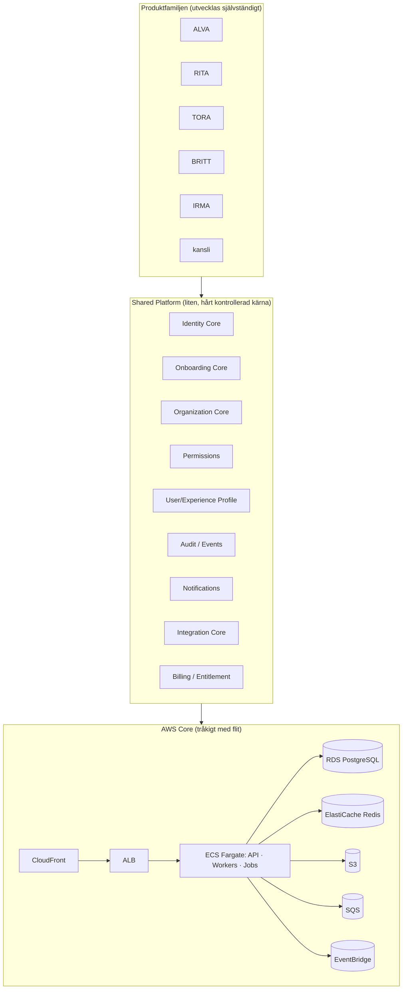
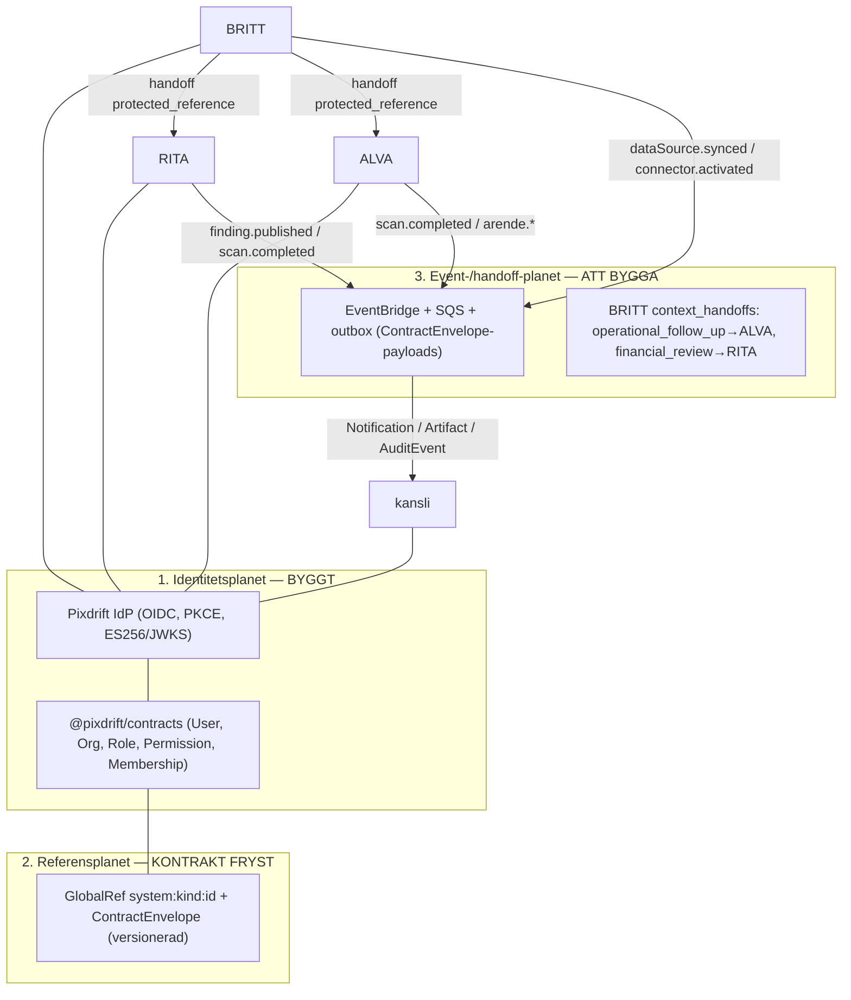

# Pixdrift — systemfamiljens arkitektur, sammanflätning och synk

Detta är den auktoritativa referensen för hur Pixdrift-systemen hänger ihop.
Den är avsiktligt fryst: subsystemen bygger mot den, inte tvärtom. Ändringar
här är en översyn, inte en detalj.

> **En princip över allt annat:** systemen delar *identitet, behörighet och
> referenser* — aldrig databas. Varje system behåller sitt datalager och sin
> integritetsmekanism. Sammanflätning sker via kontrakt, referenser och
> händelser, så att RITA:s radsäkerhet, ALVA:s hashkedjor och BRITT:s valv
> förblir intakta.

## 0. Målarkitektur, styrning och sekvens

Vi bygger inte "några hopslagna repon" utan en **liten, hårt kontrollerad
gemensam plattform under produkterna**. Styrande dokument (läs först):
[`ARCHITECTURE-CONSTITUTION.md`](ARCHITECTURE-CONSTITUTION.md) och
[`REPO-INTAKE.md`](REPO-INTAKE.md).

**Modulär backend, inte nio services.** Kod-, data- och kontraktsmässigt
separerade moduler (`/platform/{identity,organizations,onboarding,profiles,permissions,audit,notifications,integrations}`)
som kan **deploya tillsammans** tills en komponent verkligen behöver brytas ut.

**Tre profiler hålls isär** (se konstitutionen): Identity Profile (vem, tekniskt)
· Experience Profile (hur systemet kommunicerar — explicit/versionerad/reversibel)
· Business Context (vad användaren arbetar med). Produkter frågar plattformen
*"hur bör jag visa detta för Erik?"* i stället för att var och en löser det själv.

**Automationsnivåer:** L0 Observe · L1 Recommend · L2 Prepare · L3
Execute-with-approval · L4 Autonomous. Standard lågt; autonomi förtjänas.
**AI är aldrig source of truth:** Fact ≠ Inference ≠ Recommendation ≠ Action.

**Canonical Business Model** (integration-kärnans mål): all extern data
(Fortnox/Visma/bank/CRM/…) normaliseras till familjens objekt — Organization,
Person, Employee, Customer, Supplier, Invoice, Transaction, Agreement, Asset,
Project, Task, Opportunity, Document — bakom **Integration Core** (Connector ·
Credential · Connection · Sync · ExternalObject · Mapping · Webhook · ImportJob ·
SyncError). Produkten frågar "ge mig företagets fakturor", inte hur Fortnox-auth
fungerar.

### Sekvens: börja med fem (överstandardisera inte för snabbt)
Gemensamheten ger störst effekt i **Identity, Organization, Audit, Integration
Contracts, Onboarding/Profile**. Resten förtjänar sin plats i kärnan efter hand.

| Kärnområde | Målbild | Status nu |
| --- | --- | --- |
| **Identity** | User/Org/Membership/Role/Permission/Session/MFA/Consent/Device/AuthN-event | **Byggt:** IdP (OIDC/PKCE/JWKS), User/Org/Membership/Role/Permission, session. Delta: MFA, consent, device, emitterade authn-events |
| **Organization** | Person→Membership→Company (aldrig `user.company_id`); Workspace/Entitlement/Subscription/ProductAccess | **Byggt:** org + membership förstklass, tier/entitlement (org-nivå). Delta: Workspace, Subscription, ProductAccess |
| **Audit** | Gemensam, immutable audit från dag ett (who/when/product/resource/before/after/org/actor) | **Kontrakt finns** (`AuditEvent`). Delta: gemensam emission/lagring + `product`/`before`/`after`/`request_id`/`device_id` genomgående |
| **Integration Contracts** | Integration Core + Canonical Business Model | **Delkontrakt finns** (`Connector`/`DataSource`; BRITT har rikt connector-ramverk). Delta: konvergera + canonical model |
| **Onboarding/Profile** | Onboarding Engine → Experience Profile; "hur visa för Erik?" | **Ej byggt** (net-nytt, strategiskt viktigt) |

Övriga principer (inget delat DB-schema, kontrakt/events mellan system,
Postgres-tungt, tråkig AWS, testad restore, data som kronjuveler) gäller redan
och är inskrivna i konstitutionen.

## 1. Systemöversikt

| System | Roll i familjen | Stack | Datalager | Egen auth idag | Tenantbegrepp | Integritetsmekanism |
| --- | --- | --- | --- | --- | --- | --- |
| **kansli** | Navet: gemensam inloggning, uppgifter, ingång till allt | Next.js 16 (App Router), Vercel | (fil/JSON i demo) | — (OIDC-klient) | via Pixdrift-org | — |
| **ALVA** | Verkstad: guidad fordonsfelsökning, ärenden, fakturering | Rå `node:http`, Vite-klient, AWS EKS/Aurora | PostgreSQL (Aurora) | Egen HS256-JWT | `organisation_id` | Append-only hashkedja, RFC 3161-tidsstämpel, KMS-valv, TÜV |
| **RITA** | Ekonomi: lagliga skatte-/avdragsmöjligheter ur bokföring | pnpm-monorepo, Fastify + Next.js + Rust-motor, AWS | PostgreSQL (RLS) | Serversession (scrypt) | `tenants` + `legalEntities`, RLS `app.tenant_id` | Radsäkerhet (`*_owner`/`*_app`), append-only audit via rättigheter, dubbel evidens |
| **BRITT** | Drift/beslut: overlay som *aggregerar* alla system och ger vägledning | Node/CommonJS, Express, `node:sqlite` | SQLite (inbyggt) | Serversession + API-nycklar | `org_id` + enhetshierarki (company→…→team) | Krypterat credential-valv, fail-closed synk, auditlogg |
| **TORA** | Offentlig marknad: kan företaget få uppdraget? (anbud/upphandling) | Vite/React SPA + Fastify-tjänst, k8s, PostgreSQL | PostgreSQL | **OIDC/PKCE (inbyggt)** | `tenant`-claim (sträng) | Deny-by-default; `RÄTTIGHET` kräver `LegalBasis`; nivå ur signerad token |
| **IRMA** | Avtal: avtalslivscykel — granskning, workflow, signering | Vinext/Vite + React 19 (RSC), Cloudflare (D1/R2), Drizzle | SQLite/D1 (PostgreSQL i prod) | Personalidentitet **+ Magic Links** (externa mottagare) | tenant-scopat, roller | Append-only hashkedjad audit; original = oföränderligt, content-addressed bevis |

Rollfördelningen är hela poängen: **kansli** är ingången, **ALVA/RITA** är
specialistsystem som producerar (ärenden, fynd, fakturor), och **BRITT** är
overlay-systemet som samlar in via connectors och lämnar över kontext till
specialisterna.

## 2. Tre plan för sammanflätning (+ dataplanet)

### Plan 1 — Identitet & behörighet (BYGGT)
En central självhostad OIDC-tjänst (`@pixdrift/identity`) utfärdar identitet och
behörighet enligt `@pixdrift/contracts`. Alla system blir klienter/resurser:
- **kansli / RITA / BRITT** = BFF-klienter (Authorization Code + PKCE → egen
  session). ALVA:s webb likaså.
- **ALVA-plattform / ai-orkester, RITA-API** = resursservrar som verifierar
  access-tokens mot JWKS (asymmetriskt — ersätter ALVA:s delade HS256).
- **Token-claims** (frysta): `sub` = `pixdrift:user:<id>`, `org` (aktiv
  organisation med `roles` + `verb:noun`-permissions), `memberships` (alla
  organisationer användaren tillhör — samma identitet över system).

### Plan 2 — Referenser & kontrakt (FRYST v1)
`@pixdrift/contracts` (upplyft ur RITA ADR 0004) definierar de entiteter en
systemfamilj delar: **User, Organization, Role, Permission, Membership,
Connector, DataSource, Automation, Notification, Artifact, AuditEvent**.
- **`GlobalRef` = `system:kind:id`** är den universella pekaren (aldrig nakna
  UUID:n). BRITT:s handoff `mode: 'protected_reference'` *är* en GlobalRef.
- **`ContractEnvelope`** bär versionen med nyttolasten; en konsument kan vägra
  en major den inte stöder i stället för att gissa.
- **Var sak på sin plats:** domän (ALVA-ärenden, RITA-fynd, öre, regelverk) hör
  *aldrig* hemma i kontraktet. Endast plattformsentiteter.

### Plan 3 — Event & handoff (ATT BYGGA)
Synken mellan system sker via händelser och kontext-handoffs, inte delad databas:
- **Ryggrad:** EventBridge + SQS med **outbox** (RITA ADR 0003). Payloads är
  `ContractEnvelope`-inpackade händelser.
- **Händelser (namnrymd per system):** ALVA `arende.*`, RITA
  `scan.completed`/`finding.published`/`rule.changed`, BRITT
  `dataSource.synced`/`connector.activated`. Plus gemensam `AuditEvent`.
- **Kontext-handoff (BRITT → specialist):** BRITT:s `context_handoffs` med
  `purpose` (`operational_follow_up`→ALVA, `financial_review`→RITA,
  `grant_search`) och `contextPolicy`:
  - `summary_only` (default) — bara en sammanfattning + `protected_reference`.
  - `approved_data` — kräver **mänskligt godkännande** (linjerar med RITA:s
    `advisorConfirmed`-regel och ALVA:s `DELBART_KUND`/`DELBART_PARTNER`-nivåer).
- **Gemensam yta i navet:** `Notification` och `Artifact` är familjegemensamma,
  så "det här förtjänar din uppmärksamhet" och "det här har systemen gjort åt
  dig" kan visas enhetligt i **kansli** oavsett vilket system som producerade.

### Dataplanet
Ingen delad databas. **BRITT** är aggregatorn: dess connector-ramverk hämtar
kanoniska dataset (transaktioner, fakturor, kunder, leverantörer, personal,
tidsposter, arbetsorder, projekt) från Fortnox/bank/CRM m.fl. till sin SQLite,
med krypterade credentials, `sync_runs`, hälsa och capability-matris. **RITA**
läser bokföring (SIE/connector) för fynd. **ALVA** producerar
verkstadsärenden/fakturor. Varje system implementerar de gemensamma kontrakten
*ur sina egna tabeller* — ingen känner den andras schema.

## 3. Tenant-/organisationsmappning (kritisk stabiliseringspunkt)

Tre representationer måste peka på **en** Pixdrift-organisation:

| Nivå | Pixdrift (kanoniskt) | ALVA | RITA | BRITT |
| --- | --- | --- | --- | --- |
| Organisation (tenantgräns) | `Organization` (`pixdrift:org:<id>`) | `organisation_id` | `tenants.id` (RLS) | `org_id` |
| Juridisk enhet / underenhet | `Organization.legalEntities[]` | (n/a) | `legalEntities` | enhetshierarki (company→…→team) |
| Medlemskap + roller | `Membership` (user×org→roles) | `anvandare.roll` | `memberships`+`roles` | `users.role` |

Regeln: token bär `org` som `GlobalRef`; varje system håller en mappning
`pixdrift:org:<id> ↔ lokalt org-id` och sätter sin egen tenantkontext
(ALVA filtrerar på `organisation_id`, RITA `SET LOCAL app.tenant_id`, BRITT
`org_id`). Rollmappning sker mot `verb:noun`-permissions i token.

## 4. Gränser som inte förhandlas (invarianter)

- **Delad hemlighet aldrig.** Resursservrar verifierar via JWKS; bara IdP:n har
  den privata nyckeln (i drift: ALVA:s KMS-`nyckelvalv`).
- **Plattformsroller får aldrig kunddata-behörighet** (`assertPlatformRoleIsSafe`).
- **Tenant ur sessionen/token, aldrig ur en request.**
- **Pengar = minsta enhet som sträng.** Aldrig float.
- **Domän hör inte i kontraktet.** Endast plattformsentiteter i `@pixdrift/contracts`.
- **Inget blir styrande/utlämnat utan mänsklig granskning** där systemen kräver
  det (RITA `advisorConfirmed`, ALVA delningsnivåer, BRITT `approved_data`).

## 5. Stabiliseringschecklista

**Byggt och testat (37 automatiska tester, 9 sviter — inkl. Postgres):**
- [x] Pixdrift IdP: OIDC discovery, JWKS, Authorization Code + PKCE (S256),
      userinfo, RP-logout, ES256-signering, SSO mellan klienter, **publika +
      konfidentiella klienter**.
- [x] `@pixdrift/contracts`, `@pixdrift/auth-core` (scrypt + bcrypt-migrering),
      `@pixdrift/auth-client` (OIDC-klient + JWKS-verifierare).
- [x] **Token-claim-alignment:** IdP emitterar `tenant` + `scope` (beviljade) +
      `tier` vid sidan om `org`/`roles`/`permissions`; entitlement/tier i
      identitetsmodellen (org-nivå).
- [x] kansli som referensklient (E2E i webbläsare).
- [x] ALVA-adapter: nolldependency ES256/JWKS-verifierare (test mot riktig IdP).
- [x] RITA-adapter + in-repo-patch (typecheck/lint/158 unit-tester i RITA:s egen
      toolchain).
- [x] **TORA:** publik klient (`tora-web`) + audience (`tora-opportunity`)
      registrerade; token-kontraktet bevisat mot TORA:s exakta `verify.ts` +
      `principal.ts` (`tier=enterprise`, `opportunity:read` m.fl.).
- [x] **BRITT-adapter:** nolldependency CJS OIDC-BFF (WebCrypto ES256/JWKS + PKCE),
      testad mot riktig IdP.
- [x] **IRMA-adapter:** jose-OIDC (ESM) BFF för personal-inloggning, testad mot
      riktig IdP. Magic Links för externa mottagare förblir interna i IRMA.

- [x] **Varaktig IdP:** PostgreSQL-lager (owner/app), DB-baserat klientregister
      och persisterad roterbar ES256-nyckel — testat mot riktig Postgres (flöde,
      nyckel stabil över omstart, engångskoder). Se `packages/identity/README.md`.
- [x] **AI Core (`@pixdrift/ai-core`):** gemensamt modell-API över
      Claude/ChatGPT/Gemini (+ valfri AI-Gateway) med failover, provenance och
      guardrails (utdata alltid `inference`, aldrig fakta). Se `docs/AI-PROVIDERS.md`.
- [x] **Live-deploy:** kansli-navet driftsatt på Vercel (auto-deploy per push);
      se `docs/DEPLOYMENT.md`.

Se `integrations/README.md` för modulmatrisen och de två referensmönstren
(jose-OIDC ESM · WebCrypto nolldependency).

**Att låsa för stabil drift:**
- [x] **IdP-lagring (KLART):** PostgreSQL-lager (`PgStore`) med `*_owner`/`*_app`
      + snäva grants. RLS gäller subsystemens kunddata, inte IdP:ns
      plattformstabeller (dokumenterat i `packages/identity/README.md`).
- [x] **DB-baserat klientregister (KLART):** klienter läses ur `oauth_clients`;
      en ny modul = en rad, ingen IdP-kodändring. Bevisat mot riktig Postgres.
- [x] **Nyckelhantering (KLART för stabilitet):** ES256-nyckeln persisteras i
      `signing_keys` med stabil `kid` över omstart + rotationsstöd
      (`otherPublicJwks`). KMS/HSM är valfri härdning senare.
- [ ] **Paketdistribution:** protokoll-först (OIDC + JWKS + claim-spec).
      `@pixdrift/*` valfria hjälppaket (GitHub Packages) för JS-moduler, aldrig
      krav — icke-JS-moduler (t.ex. TORA:s tjänst) använder standardbibliotek.
- [ ] **Org-mappning:** IdP äger kanonisk org; varje modul håller en tunn
      `pixdrift:org ↔ lokalt org-id`-mappning, fylld lat vid första inloggning.
- [x] **Token-claim-alignment (surfaced av TORA):** KLART — IdP emitterar `sub`,
      `tenant` (org-`GlobalRef`), `tier` (deny-by-default) och `scope`/`scp`
      (beviljade `verb:noun`) vid sidan om `org`/`roles`/`permissions`.
      Entitlement/tier finns nu i identitetsmodellen (org-nivå).
- [x] **Publika klienter:** KLART — IdP stöder publika klienter (PKCE, ingen
      hemlighet). `tora-web` + audience `tora-opportunity` registrerade.
- [x] **E-legitimation som inloggning:** utgår (beslut) — inte en
      inloggningsmetod. Tar bort broker, certifikat och externt beroende.
- [ ] **Landa adaptrarna:** RITA/BRITT-PR:er kräver skrivåtkomst. **ALVA avvaktar
      tills vidare** (patchen är vilande, inte bortkastad).

**Nästa fas (event-/handoff-planet):**
- [ ] Frys händelsenamn + `ContractEnvelope`-payloads per system.
- [ ] EventBridge + SQS + outbox (RITA ADR 0003) som gemensam ryggrad.
- [ ] BRITT `context_handoffs` → RITA/ALVA med `contextPolicy`-styrning.
- [ ] Gemensam `Notification`/`Artifact`-yta i kansli (navet).

## 6. Kartlagda repon

| Repo | Roll | Inkopplingsstatus |
| --- | --- | --- |
| `wolfoftyreso-debug/kansli` | Nav + plattformspaket + IdP | Byggt (denna kodbas) |
| `wolfoftyreso-debug/alva` | Verkstad | **Avvaktar tills vidare** (adapter byggd + testad, patch vilande) |
| `wolfoftyreso-debug/RITA` | Ekonomi | In-repo-patch byggd + typecheckad; klar att landa |
| `wolfoftyreso-debug/BRITT` | Drift/overlay | **Adapter byggd + testad** (nolldependency CJS OIDC-BFF); wiring-README klar; in-repo-patch återstår |
| `wolfoftyreso-debug/TORA` | Offentlig marknad/anbud | **OIDC-native, inkopplad via konfig**; token-kontrakt bevisat (test). Peka klient+tjänst mot IdP |
| `wolfoftyreso-debug/IRMA` | Avtal | **Adapter byggd + testad** (jose-OIDC ESM, personal); Magic Links interna; in-repo-patch återstår |
